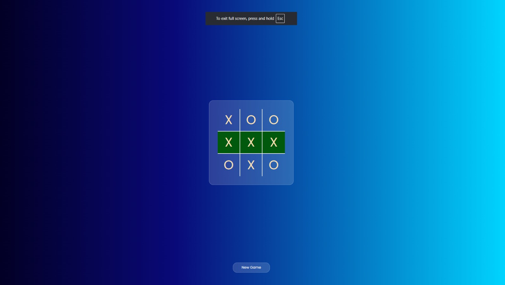

# ❌⭕ Tic Tac Toe

A classic 2-player Tic Tac Toe game built with pure **HTML, CSS, and Vanilla JavaScript** — no frameworks, no dependencies.

---

## 🚀 Live Demo

> Open `index.html` directly in your browser — no server needed!

---

## 📁 File Structure

```
tic-tac-toe/
│
├── index.html      # Game structure & layout
├── index.css       # Glassmorphism UI styling
└── index.js        # Game logic
```

---

## 🎮 How to Play

1. Player **X** always goes first
2. Players take turns clicking any empty box
3. First to get **3 in a row** (horizontal, vertical, or diagonal) wins
4. If all 9 boxes fill up with no winner → **Tie!**
5. Click **New Game** to reset

---

## ✅ Winning Combinations

| Type | Positions (0-indexed) |
|---|---|
| Row 1 | 0, 1, 2 |
| Row 2 | 3, 4, 5 |
| Row 3 | 6, 7, 8 |
| Column 1 | 0, 3, 6 |
| Column 2 | 1, 4, 7 |
| Column 3 | 2, 5, 8 |
| Diagonal ↘ | 0, 4, 8 |
| Diagonal ↙ | 2, 4, 6 |

---

## 🛠️ Tech Stack

- **HTML5** — Game layout
- **CSS3** — Glassmorphism design, CSS Grid
- **JavaScript (ES6+)** — Game logic & DOM manipulation
- **Google Fonts** — Poppins

---

## ✨ Features

- 🎨 Glassmorphism UI with gradient background
- 🏆 Winning boxes highlight in green
- 🔒 Board locks after game ends
- 🔁 New Game button to reset
- 📱 Responsive design

---

## 🔮 Future Improvements

- [ ] Sound effects on click & win
- [ ] AI opponent (single player mode)
- [ ] Score tracker across rounds
- [ ] Animations for X and O
- [ ] Dark / Light mode toggle

---

## 📸 Preview

> 
> *(Add a screenshot of your game here)*

---

## 📄 License

This project is open source and free to use.
